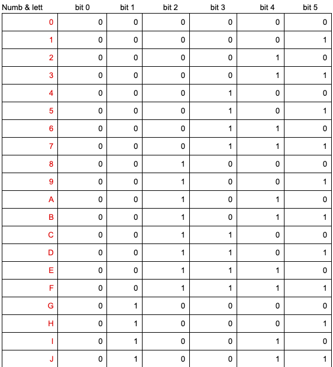
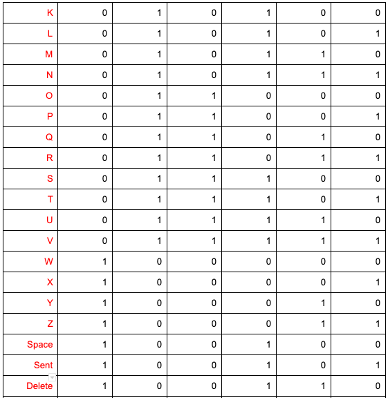

# Binary-Morse program | Unit2-HasanMajdi-


Binary-Morse program 
===========================
A program to transfer understandable messages using two buttons from earth to mars crossing by the moon. 

Contents
---------
  1. [Planning](#planning)
  1. [SolutionOverview](#SolutionOverview)
  1. [Development](#development)
  1. [Evalution](#evaluation)
  1. [improvements](#improvements)
  
  Planning
----------
### Definition of the problem 
we are in the year 2050, people are travelling around the universe and we have a problem transfering messages between astroununts, it is a really important thing to have a good tool to communicate with others. so here we are working on arduino to build a stations that transfer understandable messages from earth to moon in Morse code then sending from moon to mars using binary code, using simple two arduino buttons method, the messeges should be understandable the same way on the three stations.

### Solution proposed
so we are using arduino to build a three stations, in three buildings, each building represent a planet (earth - moon - mars) 
then sending messages from/to these stations, why arduino? because arduino is simple to use, cheab, and avaliable for us, it provides us with what we need to complet this project.

### Success criteria 
1. Messages should be transfered from/to each station(planet).
2. The system uses 100W lights for communication.
3. The system uses two buttons only to write the messages. 
4. LCD screen is there to show the messages.
5. The system allows the clients to use all English letters, all numbers, and SEND, DELETE, and SPACE are existed options
6. The system is simple to use and considering Usability.


SolutionOverview
-----------------

### System Diagrams 
Here are the flow diagrams for the codes. 

**fig.1** flow chart of English to binary system


**Tables** 
Tables for the English to binary system, this is used to mke it easier to determine the the letters and the binary used.  




Development
-----------
 
 ### Arduino 
 Arduino is an open-source software and hardware development board that can be used by tinkerers, and makers to design and build devices/circuits, Arduino codes are run machine code compiled from either C, C++ or any other language that has a compiler for the Arduino instruction set we 
 
 ### Serial Mentor 
 It is the screen where you see the output of the code you wrote.
 
 ***Arduino Codes Content***
  
 1.```
 void setup()
{
}
 .```
this part will run only once. 

2.```
void loop()
{
}
.```
this part of the code will loop, which means everything you put inside will be repeated. 

the variable ```void``` indicates that the function is expected to return no information to the function from which it was called.

3.```Functions``` are blocks of organized, reusable code that is used to perform related action again, which means they are used to avoid repetition of the commands in a code. 
 
*Example of the use of functions

```.C
// this is an example of using functions 

int redLED = 13; 
  int greenLED = 12;
  int orangeLED = 11;
	int whiteLED = 9; 
	int blueLED = 8;
	int yellowLED = 7;


void setup()
{
  pinMode(redLED, OUTPUT);
  pinMode(greenLED, OUTPUT);
  pinMode(yellowLED, OUTPUT); 
  pinMode(orangeLED, OUTPUT);
  pinMode(whiteLED, OUTPUT);
  pinMode(blueLED, OUTPUT);
}

void loop()
{
  blink(1000, redLED);
  blink(1000, greenLED);
  blink(1000, yellowLED);
  blink(1000, whiteLED);
  blink(1000, blueLED);
  blink(1000, orangeLED);
  
}
// this function blinks a LED
// only argument is the time 
void blink(int time, int port){
  digitalWrite(port, HIGH);
  delay(time); // Wait for 1000 millisecond(s)
  digitalWrite(port, LOW);
  delay(time); // Wait for 1000 millisecond(s)
}
```

### Practicing coding with modern C

**OddEven**

this is a program that prints all Odd and Even numbers from 1 to 1000. 

```.C 
int result = 0;
int odd = 0;

void setup()
{
 Serial.begin(9600);
}

void loop()
{
  for (int x = 1; x < 1001; x+=2) {
  Serial.println("even numbers are"); 
  Serial.println(result+x); 
   
  }
    
    for (int i = 2; i < 1001; i+=2) {
  Serial.println("odd numbers are"); 
  Serial.println(odd+i);  
		}
}
```
**Sequence**

This is a program that prints a sequence of numbers from 0 to 6 repeatedly.
```.C
char *myStrings[] = {"0123456" };

void setup()
{ 
  Serial.begin(9600);
}

void loop()
{
for (int i = 0; i < 1; i++) {
    Serial.println(myStrings[i]);
    delay(10);
}
}
```
**7Factors**

this program prints the factors of number 7 from 7 to 700. 
```.C 
void setup()
{
  Serial.begin(9600);
}

void loop()
{
 for (int i = 0; i < 707; i+=7) { 
   Serial.println(i);
}
 	}
```
**Greetings**

This program prints greetings in Arabic/Turkish.
```.C
char *myStrings[] = {"Merhaba"};

void setup() {
  Serial.begin(9600);
}

void loop() {
  for (int i = 0; i < 1; i++) {
    Serial.println(myStrings[i]);
  }
}
```

**Traffic Light** 

This is a Traffic Light created by ThinkerCard, then built in class by Arduino. 


**Fig. 1.** Circuit for the traffci light

As you can see in Fig. 1, the circuit for the traffic light includes three LEDs, connected with wires to the Arduino.

In class using Arduino Kit.


*Code*

```.C
void setup()
{
  pinMode(13, OUTPUT);
  pinMode(10, OUTPUT);
  pinMode(8 , OUTPUT);
}

void loop()
{
  digitalWrite(10, HIGH);
  delay(1000); // Wait for 1000 millisecond(s)
  digitalWrite(10, LOW);
  delay(100); // Wait for 1000 millisecond(s)
  
  digitalWrite(13, HIGH);
  delay(1160); // Wait for 1000 millisecond(s)
  digitalWrite(13, LOW);
  delay(100); // Wait for 1000 millisecond(s)
  
  digitalWrite(8, HIGH);
  delay(5000); // Wait for 1000 millisecond(s)
  digitalWrite(8, LOW);
  delay(1000); // Wait for 1000 millisecond(s)
  
} 
```
 
**Counter In Arduino**

This program creates a binary counter from 0 to 31 with arduino using LED lights. 

**Flow Diagram**


**How to convert from decimal to binary**

1. Divide the dividend (number) by divisor 2 and get the remainder and the quotient.
2. If the remainder is not zero then becomes dividend and follow above steps. 
3. As the quotient has become zero, the binary is all the remainders from bottom or from right side which consists of 0 & 1.

**Using Modulo** 
Finding the remainder of division of one number by another. 
For example: ```a % n = r ```. ``` 5 % 2 = 1 ``` because there are two pairs and only one left.

If n = 0 the equation may return undefined.

The result is always a whole integer.

If n is greater than a the result is a. 

**code for the counter**
```.C
int ledPin[] = {13,12,11,10,9,8};
// an arry to de
fine the pins

void setup()
{
  for (int i = 0; i < 6; i++)
  {
    pinMode(ledPin[i], OUTPUT);
  }
}

void loop()
{
  for (byte counter = 0; counter <= 32; counter++)
  {
    displayBinary(counter);
    delay(2000);
  }
}

void displayBinary(byte num)
{
  for (int i = 0; i < 6; i++)
  {
    if (bitRead(num, i)==1)
    {
      digitalWrite(ledPin[i], HIGH);
    }
    else
    {
      digitalWrite(ledPin[i], LOW);
    }
  }

}
```
**Counter in class with arduino**


### Logic Gates, K-Map Tables and Logical Equations


Logic gates are the basic building blocks of any digital system. It is an electronic circuit having one or more than one input and only one output. The relationship between the input and the output is based on a certain logic. Based on this, logic gates are named as AND gate, OR gate, NOT gate XOR gate or so.

**K-Map Tables**

The Karnaugh map is a method of simplifying Boolean algebra expressions.


Equations for outputs B and C from this table.


We are using this method to decrease the amount of time and effort spent on the code. 

(   bool equa = b || (!a && !a && !c) || (a && c);
    digitalWrite(outa, equa);    )
    
    for example the code here is the equation we got from the truth tables we did in the class. 
    
   
   **Using LCD Screen**
   
   using LCD screen is really important for this project, because it is part of the sccess criteria to include it. also because we want the client to be comfortable using the project. 
   
   

### Important Terms

**CPU:**  Central Processing Unit

**RAM:**  Random Access Memory 

**ROM:**  Read-Only-Memory 


|**level**|**Description**|
|-----|------------|


**Types of Data**
``
boolean (8 bit) - simple logical true/false
byte (8 bit) - unsigned number from 0-255
char (8 bit) - signed number from -128 to 127. 
unsigned char (8 bit) - same as 'byte'; 
word (16 bit) - unsigned number from 0-65535
unsigned int (16 bit)
int (16 bit) - signed number from -32768 to 32767. 
unsigned long (32 bit) - unsigned number from 0-4,294,967,295. 
long (32 bit) - signed number from -2,147,483,648 to 2,147,483,647
float (32 bit) - signed number from -3.4028235E38 to 3.4028235E38
``
**Feasibility Study:**  Analyzes a project and its potential, it is used to tell whether the project is should be pursued or not

**Utilitarianism:** When designing a new system, we usually try to design it for the greatest good for the greatest number of people. Utilitarianism • When designing a new system, we usually try to design it for the greatest good for the greatest number of people. 

**IMAP** 

In computing, the **Internet Message Access Protocol** (IMAP) is an Internet standard protocol used by email clients to retrieve email messages from a mail server over a TCP/IP connection. 
it Can be found in the Email. 


**Registers**

in computer architecture, a processor register is a quickly accessible location available to a computer's central processing unit (CPU). 

Registers usually consist of a small amount of fast storage.
Registers are typically addressed by mechanisms other than main memory, but may in some cases be assigned a memory address. 

Registers are normally measured by the number of bits they can hold, for example, an "8-bit register", "32-bit register" or a "64-bit register" or even more.


**Logic Gates:** A combinational circuit that performs an elementary logic operation and usually involves one output.

**What is Usability?**

It is part of user experience. 
Process of designing a product with users preferences in mind. 
degree of ease that a product can be used to attain the proposed goal [1].

**Human-centerd design HCD**

Human-centerd design HCD according to Wikipedia[2] is an approach to problem solving, commonly used in design and management frameworks that develops solutions to problems by involving the human perspective in all steps of the problem-solving process. Human involvement typically takes place in observing the problem within context, brainstorming, conceptualizing, developing, and implementing the solution.

**What is HCD?**
human-centered design or (HCD), it is a Design processes which involve the end user throughout the product development and testing process, can be crucial in ensuring that the product meets the needs and capabilities of the user [2].

****Arduino VS Computer****

**Peripherals:** 

Input or output devices that are connected to computer are called peripheral devices.
These devices are designed to read information into or out of the memory unit upon command from the CPU and are considered to be the part of computer system. 

**Where in the Arduino?**


In Arduino there are:

 18  Digital Outputs pins. 
 
8  Power/Reset Pins. 

6  Analog Inputs.

**Where in the computer?**


peripheral or peripheral device is an ancillary device used to put information into and get information out of the (computer). 

**Input peripherals:** Allows user input, from the outside world to the computer. Example: Keyboard, Mouse etc.

**Output peripherals:** Allows information output, from the computer to the outside world. Example: Printer, Monitor etc.

**Input-Output peripherals:** Allows both input(from outised world to computer) as well as, output(from computer to the outside world). Example: Touch screen etc.


**Programming in C language**

   

**What is C?**

C is a high-level and general-purpose programming language that is ideal for developing firmware or portable applications. Originally intended for writing system software, C was developed at Bell Labs by Dennis Ritchie for the Unix Operating System in the early 1970s. 

**What is the experiance like?**

As a person who have tried BASH and Arduino, I would say C is much more Comfort working with than BASH and Arduino, i think because bash is more complex in terms of writing and it has so many requairments to the code in order to run smothely, also in Arduino because we are not only dealing with coding (the softwear part), but we have to do the hardwear also which is making it more harder. 

**Codes I have Done in C**

1. A program in C to display the cube of the number upto given an integer.

```.C

int main(void) {
//define variables 
int i,cube,num; 
//ask user for number
printf("Enter a number"); 
scanf("%d",&num);

for (int i=1; i<=num; i++){
printf("Number is : %d and cube of the %d is :%d \n",i,i, (i*i*i));
     } 
}

```

2. A program in C to read 10 numbers from keyboard and find their sum and average.

```.C

int main(void) {
  
  //Define varaibles 
  int num; 
  int sum=0; 
  float ave; 
  //Ask user for nmbers 
  for (int i=0; i<10; i++){
  printf("Enter the number\n"); 
  scanf("%d", &num); 
  //calculate the sum 
   sum += num; 
   ave = sum / 10; 
  }
  //show restlt 
  printf("the addition of this is %d\n",sum); 
  printf("the averge is %f", ave); 
}

```


3. A program a C program to calculate the factorial of a given number.


```.C

int main(void) {

int i,f=1,num;

    printf("Input number of terms : ");
    scanf("%d", &num);
    for(i=1;i<=num;i++)
    f=f*i;
    {
	 printf("The Factorial of %d is: %d",num,f);     
   }
 }
 
 ```
 
 4. A program in C to display the number in reverse order.
 
 ```.C
 
 void main(){
    int num,r,sum=0,t;

    printf("Input a number: ");
    scanf("%d",&num);

    for(t=num; num != 0; num=num/10) {
         r=num % 10;
         sum=sum*10+r;
    }
printf("The number in reverse order is : %d \n",sum);
}

```

In C, it is important is that you tell the program the variable, store and show the data type. 
for example: 
```.C 
scanf("%d",&num);
```
here the variable is shown as &num and the data type at the begining as %d.

5. A program in C to find the sum of the series 1 +11 + 111 + 1111 + .. n terms.

```.C 

int main(void) {
//define varibles
int i,n,t=1,sum=0; 
//ask user for number
printf("Enter number");
scanf("%d",&n);
for (i=1;i<=n;i++)
{
     printf("%d ",t);
      if (i<n)
      {
          printf("+"); 
          
      }
//printing 1 as long as i<n
     sum=sum+t;
     t=(t*10)+1;
  }
  printf("\nThe Sum is : %d\n",sum);
}

```


 


## References
[1]  international design fundation "Usability". 25 Nov, 2019

[2] NCBI, "Human-Centered Design Study: Enhancing the Usability of a Mobile Phone App in an Integrated Falls Risk Detection System for Use by Older Adult Users". by Arun Keepanasseril. 30 May, 2017


