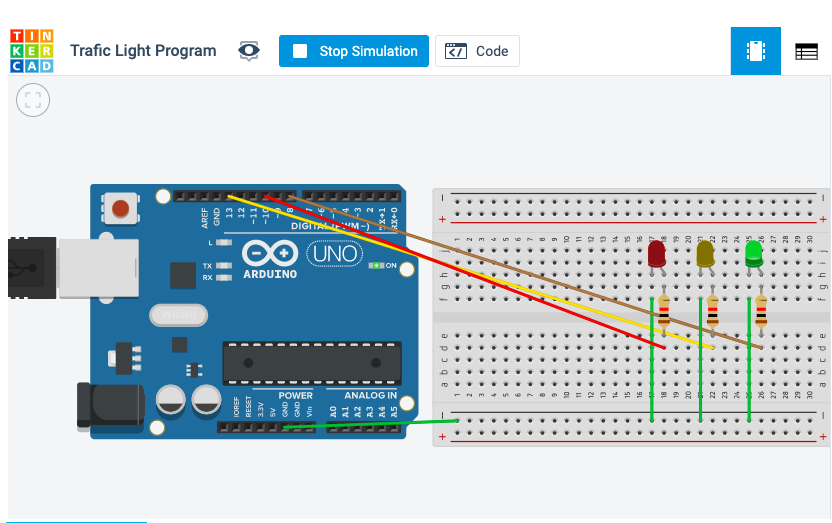

# Binary-Morse program | Unit2-HasanMajdi-


Binary-Morse program 
===========================
A program to transfer understandable messages using two buttons from earth to mars crossing by the moon. 

Contents
---------
  1. [Planning](#planning)
  1. [SolutionOverview](#SolutionOverview)
  1. [Development](#development)
  1. [Evalution](#evaluation)
  1. [improvements](#improvements)
  
  Planning
----------
### Definition of the problem 
we are in the year 2050, people are travelling around the universe and we have a problem transfering messages, it is really important thing to communicate with others. so here we are working on a program that transfer understandable messages from earth to moon in Morse code then sending from moon to mars using binary code, the messeges should be understandable the same way on the three stations.

### Solution proposed
we are using arduino to build a three stations, in three buildings, each building represent a planet (earth - moon - mars) 
then sending messages from/to these stations.

Development
-----------
 
 ### Arduino 
 Arduino is an open-source software and hardware development board that can be used by tinkerers, and makers to design and build devices/circuits, Arduino codes are run machine code compiled from either C, C++ or any other language that has a compiler for the Arduino instruction set we 
 
 ### Serial Mentor 
 It is the screen where you see the output of the code you wrote.
 
 ***Arduino Codes Content***
  
 1.```
 void setup()
{
}
 .```
this part will run only once. 

2.```
void loop()
{
}
.```
this part of the code will loop, which means everything you put inside will be repeated. 

the variable ```void``` indicates that the function is expected to return no information to the function from which it was called.

### Practicing coding with modern C

*OddEven*

this is a program that prints all Odd and Even numbers from 1 to 1000. 

```.C 
int result = 0;
int odd = 0;

void setup()
{
 Serial.begin(9600);
}

void loop()
{
  for (int x = 1; x < 1001; x+=2) {
  Serial.println("even numbers are"); 
  Serial.println(result+x); 
   
  }
    
    for (int i = 2; i < 1001; i+=2) {
  Serial.println("odd numbers are"); 
  Serial.println(odd+i);  
		}
}
```
*Sequence*

This is a program that prints a sequence of numbers from 0 to 6 repeatedly.
```
char *myStrings[] = {"0123456" };

void setup()
{ 
  Serial.begin(9600);
}

void loop()
{
for (int i = 0; i < 1; i++) {
    Serial.println(myStrings[i]);
    delay(10);
}
}
```
**Traffic Light** 

This is a traffic built in class by arduino. 


 
